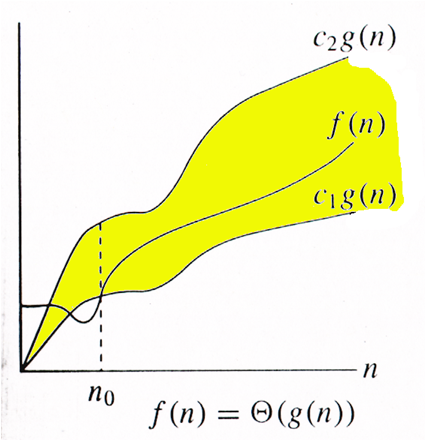

## Class #1

- **Data anatomy**
- **Classical Methods**

# Data anatomy

**Record:** data containing multiple fields

**Key:** Unique ID 

**Key Field:** attribute targeted during comparasion, ex: (name, EMAIL, role)

## Internal search:
Executed within RAM, ex: (`int list = []`) running on RAM 

## External Search: 
- Executed across Secondaty Storage (Disk/Files)
- **Scalable** to massive (Non-volatile?) files
- Limited by I/O latency (Transfer time)
- Optimizacion focuses on reducing disk block **READS**

## Main problem:

**RAM <------ I/O Costly Transfers -----> Disk Storage**

## Performance Measures !!!

- **Number of Comparasions:** How many comps had to be done to acomplish an task (better appreciation)
- **Execution time:** Dependency on hardware (Absolute CPU dependent) 
- **Disk Access Operations:** Crucial for external block I/O analysis 

### Asymptotic Analysis (Big-O)

#### Worst case scenario with a dataset of n as **n -> Infinite**



- **f(n)** will never go above **C2 g(n)** meaning **O(f(n))**

# Classical Methods 

Classical methods are **foundational** and widely studied.

- Sequential Search (Lineal Search)
- Binary Search 
- Key Transformation Search (**Hashing**???) (Best performance on most scenarios)

## Sequential Search 

Lineal search from `index 0 to n - 1`, suitable for unsorted datasets.

- **Best case:** O(1)
- **Worts case:** O(n)
- **Avg case:** O(n)

```c
int sequentialSearch(int data[], int x, int size) {
    for (int i = 0; i < size; i++) {
        if (data[i] == x) return i; // found
    }
    return -1; // not found
}
```


## Binary Search 

**Prerequsite**: The dataset must be sorted. Uses divide-and-conquer strategy, cutting the space in half on each iteration.

mid = floor((low + high)/2)

- **Performance**: O(log n)

```c
int binarySearch(int data[], int x, int size) {
   
    int left = 0;
    int right = size - 1;

    while (left <= right) {
        int pivot = (int)((left + right) / 2);
        if (data[pivot] == x) {
            return pivot;
        }
        else if (data[pivot] > x) {
            right = pivot - 1;
        }
        else {
            left = pivot + 1;
        }
    }
    return -1;
}
```

## Key Transformation Search (Hashing)

Hashing uses mapping (from cardinal to polar) equivalence from fn to gn context. In computing mapping is a representantion from the dataset itself. 

A key runs through to compute it's position arrat index directly. (???)

**Example:**

Search key: 845 ---> f(key)= key mod(10) ---> Target Index 5

- **Idealized Mapping**: Target Complexity O(1).
- **Operational Challenge**:  Multiple independent keys mapping to match slots triggers index assignment conflicts.


