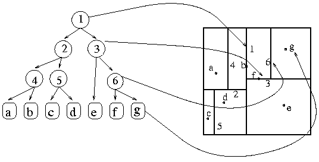

# Class3

## Advanced Internal Search Methods

- Residue-Based 
- Digital Data Structures 
- Spacial Organization
- In-Memory Indexing

**Note**:

**Internals**: Lineal, Binary, Hashing

### Residue-Based I

#### Residue Search 

An advanvanced retrival framework using mathematical properties of modular arithmetic equivalences to map partitions of keys into distinct address spaces.

**Note**: On each residue store one unique value.

### Residue-Based II

#### Multiple Residue Search 

Improves simple key-to-mapping distribution by running the identifier throuhg a cascade od distinct modular operaions 

H(k) = {k mod (mod m1), k (mod m2)}

This multi-residue insertion pattern drastically reduces clustered placement conflicts.

## Digital Data Structures

### Digital Search Trees: Tries 

#### Definition (Trie / Prefix Tree)

An ordered tree data structure where nodes do not store their actual search keys. Instead, a node's position path in the tree hierachy aductates the associated string index key value.

Key benefits: 

- Search runtme is tied strictly to **key length (L)** 
- **Complexity**: O(L)
- **Ideal for auto-complete** dictionaries and IP routing path evaluations.

### Spatial Search Methods

#### The Grid Method

Divides a continuous multi-dimensional search coordinate space into uniform rectangular geometric cells (bins). Eliminates checking unrelaed distant spaces.

##### 2D trees (k-d Trees)

A space-partitioning data structure tha alternates geometric axis coordinate boundaries.
The raw data is inserted by context (context fn).

◘
 
### In-Memory Index Tables 

#### Index Table

A lightweight, auxiliary structure containing ordered key fields  alongside corresponding memory address references. Speeds up access without reorganizing massive raw underlying records.

An auxiliary Structure re orders tables based on keys (???), but it does not affect nor re orders the original data.

**Note**:  Highly used in relational DB 

### Analisys 

- Multiple Redidue O(1) -  Space Medium  - Dimensionality 1D unique Keys  
- Digital Tree (Trie) O(L) - Space High - Dimesional Sequential Strings 
- Grid Structure O(1) Avg - Space High Array Scale  - Dimensional Multi-D coordinates
- k-d Spatial Tree O(Log n)  - Space Linear - Dimensional k-Dimensions

**Note**: Best Utility Table indexation