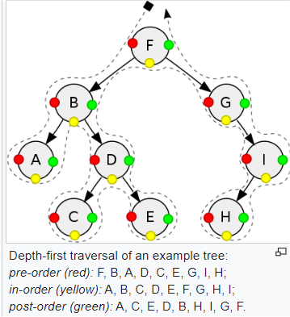
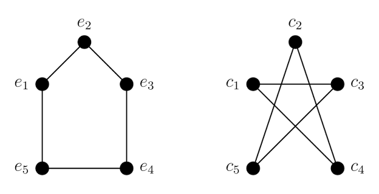

# Class 6 - Unit 5

## What is a graph 

- A graph G = (V,E) is a discrete mathematical structure used to model pairwise relationships between objects. It consists of a set of Vertices(V) and a set of Edges (E) connecting them.

### Core Components

- Vertices (Nodes): Represent fundamental entitries (e.g., cities, servers, users)

- Edges (Links): Represent the relationships or connections between entities (e.g., roads, cables, friendships)

## Vertex Degree (deg(v))

The  degree of a vertex is the total number of edges incident to (connecting to) that vertex. In directed graphs, it is divided into in-degree and out-degree.

## Graph Traversals 

Moving through a graph sequentially creates different topological squences based on specific repetition constraints.

Note: In the same graph when doing different traversals we get different outputs

- **Walk**: Any sequence of alternating vertices and edges. (No restrictions)
- **Trail**: A walk in which all edges are distinct (Vertices can be repeated).
- **Path**: A trail in which all vertices (and thus edges) are distinct. (Vertices can be repeated).

### Cycles and Circuits 

- **Circuit**: A trail that starts and ends at the exact same vertex.
- **Cycle** : A path that starts and ends at the exact same vertex (no other repeated vertices)

### Subgraphs and Graph Isomorphism 

- **Subgraphs** 
A graph H is a subgraph of G if its vertices and edges from subsets of those in G.

[Watch_Video](https://www.youtube.com/watch?v=D3_QWWJFoew)

- **Isomorphism**: Two graphs are isomorphic if they contain the exact same topological structure, despite drawing variations or different vrtex labels.

## The power of abstraction 

Graphs reuce complex systems into pure structural logic, enabling the application of univeral algorithns.

## Eulerian Pths / Circuits (Edges)

A traversal that visits every edge in the graph exactly once.

- Euler Circuit: Exists iff every vertex has an even degree
- Euler Path: Exists iff exactly zero two verices han an odd degree

## Hamiltonian Paths / Circuits (Nodes)

A traversal that visits every vertex in the graph exactly one.

- Constraint: Finding a Hamiltonian circuit is an NP-Complete problem (e.g. The traveling Salesperson Problem)

NP-Complete, non polinomial problem. the more elements the more resourses it consumes (exponential)

## Algorithms and Analysis

### Graph Traversals and Pathfinding 

Algorithm performance in graphs is dictated by the combined total Vertices and Edges.

- BFS (Breadth-First) Shortest unweighted path time, Complexity O(V + E) type Traversal
- DFS (Depth-First) Cycle detection, Maze , Complexity O(V + E) type Traversal
- Dijkstra's Shortests weighted path O(V log E), type  Greedy
- Kruskal's/ Prim's, Minmum Spanning Tree, Complexity  O(V log E), type  Greedy

### Memory Representation Overhead 

- Adjacency Matrix O(V**2) space Best for dense graphs
- Adjacency List O(V + E) space Best for sparse graphs
