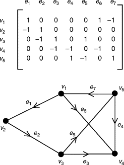

# Class 8 - Unit 6

## Graph representation and computational structures
- Matrix, adjacency Structures, Implementation Strategies

### Graph representation 

**Representation Trade-offs**

Different graph representation serve distinct neeeds. Each offers unique trade-offs between: 

- Memory usage 
- Computational speed 
- Ease of manipulation

**Matrix-Based Representations**

- Adjacency Matrix
- Incudence Matrix
- Circuit Matrix
- Cut-set Matrix
- Path Matrix

### Adjacency Matrix 
A V * V  boolean matrix where A[i][j] = 1 if the edge exists 

**Advantages**
- O(1) edge lookup 
- Simple operations
**Disadvantages**
- O(V**V) sparce always
- Wasteful for sparce graphs

Note: Sparce indicates a matrix full of ceros

## Matrix for analysis

### Incidence Matrix 
A V x E matrix (Vertices x Edges) where I[i][j] = 1  if vertex vi is incident to edge ej, else 0.

for directed graphs -1 Tail + 1  Head

Useful for: Cycle detection and fundamental circuit analysis

### Circuit Matrix

Derived from fundamental cycles. Each row represents a cycle, each column and edge.

Note: Useful for Graph Analysis 

### Cut-Set Matrix 
Represents fundamental cuts (Edge sets tha disconect the grap when removed)

### Key Property

Circuits and Cut-Sets exhibit algebraic duality iver finite fields. This relationship underlies matroid theory and network reliability analysis

### Path Matrix 

A V x V matrix where P[i][j] = 1 path exists from vi to vj, else 0 

**Transitive Closure**

Computing  the path matrix is  equivalent  to finding the transitive closure of a directed graph

Algorithm: Floyd-Warsall **Cube order**!!!

Aplications 
- Strongly connected component detection.
- Research Analysis in DAGs. (Directed Acyclic Graph)
- Dependency analysis.

## Adjacncy List 
or each vertex, mantain a linked list or array of adjacent vertex, Space  O(V+E)

**Advantage** 
- Efficient dor sparse graph 
- Fast adjacency iteration

**Disadvantages**
* O(deg(v)) edge lookup

### Adjacency Arrayas

Note: Not easy to relocate 

Flatten all adjacenc lists into a single continuous array with index pointers.

Combines spatial locality with list flexibility

## Implementation Considerations

- C/C++ manual memory  + arrays/pointers for speed (better for small graphs)
- Java/Python/JavaScript HashMap/Dictionary/Json for adjacency with automatic memory 
- Real-time Adjacency arrays for predictible cache behavior

### Pseudocode: Basic Graph class

Graph 

adjacency: List[]

+addEdge(u,v)
+getNeighbors(v)
+edgeExists(u,v)

### Space complexity Comp 
to-do

# Class 9 - Unit 6

**Dense Graphs**

- Edges = VxV: use adjacency Matrix

- Edges << VxV: use Adjacency lists

**Note** Adjacency lists are harsh to manage in C.

## Key Takeaways 

**Graph Matrices** Provides mathematical richness for theoretical analysis but consum quadratic space.

**Adjacency Structures** Lists and arrays offer linear space complexity and efficient algorithm.

**Selection Criteria**

- Graph Density
- Operation frecuency
- Memory constraints
- Cache behavior requirements

