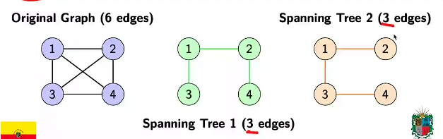
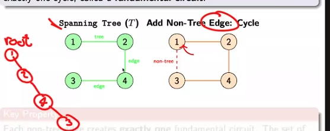
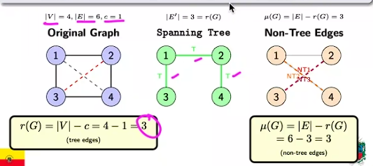
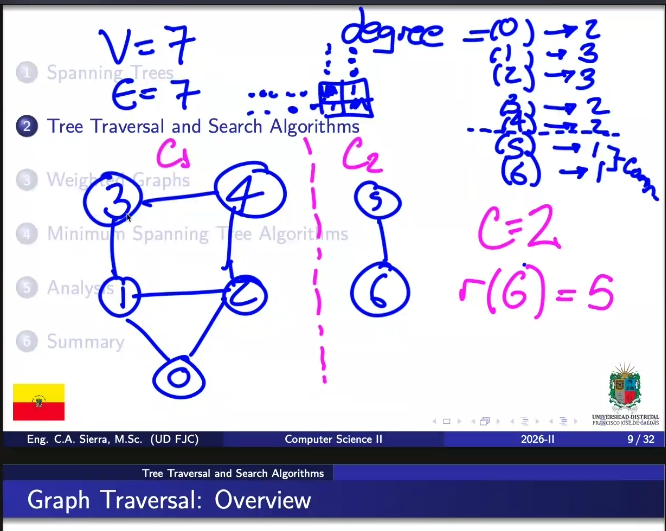
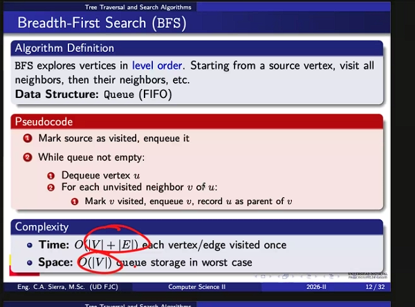
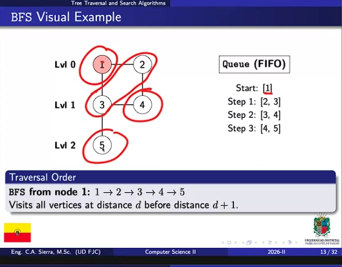
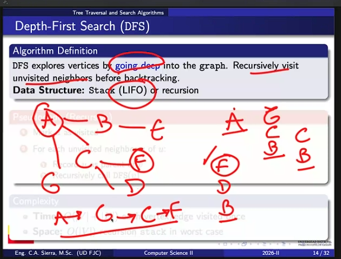
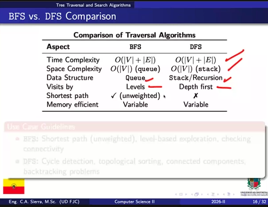
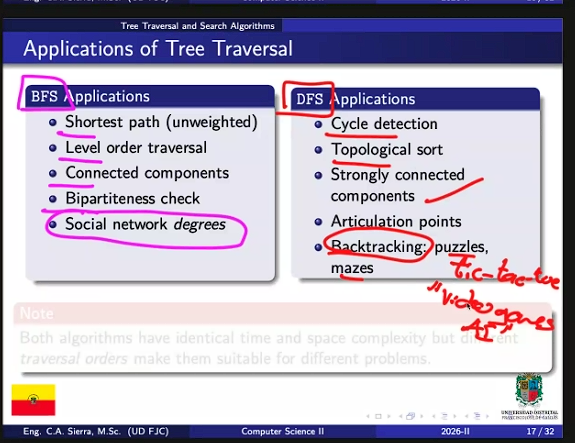
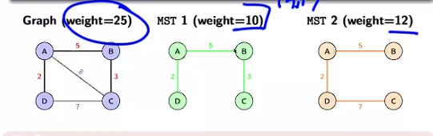

 # Class 10 Unit 7 - 8

## Find tree centers 
Leaf Stipping Method 
 
 - Start With all vertices as candidates
- Iteratively remove leaves (degree 1 vertices)
- When $|V| <= 2$ vertices remain: these are the centers 

### Complexity 
Time O(|V| + |E|) , Space: O(|V|)

### Alternative Approach

Find vertex with minimum eccentricity though diameter endpointes (two BFS passes) (Very Expensive)

## Complexity Analysis Framework 

### Factoes Affecting Performance

- **Greaph density**: Sparse vs Dense affects algorithm selection
- **Representation**: Adjacency list vs matrix impacts operation costs 
- **Operation frequency**: Trade-off between preprocessng and query time
- **Memory constraints**: Space-time trade-off in practical systems

### Best Practices 
- Use adjacency list for sparse trees
- Cache computed distances when repeatedlly querued 
- Leverage tree structure (unique paths) for optimizations

### Topics Covered 

- **Graph operations**: Union, Intersection, Ring sum, and structural modifications.

- **Trees as Graphs**: Specialized graph structures with *unique properties*. (e.g. n-arry tree)

- **Distance, Eccentricity, and center**: Metrics for analyzing tree topology and finding central nodes.

- **Algorithms and Analysis**: Efficient computational methos and complexity characterization.

## Unit 8 - Trees, Spanning Trees, and Graph Traversal

### Spanning Trees 

Definition 

A spannig  tree of a conected graph G = (V,E) is a subGraph T = (V, E') where:

- T is a tree (connected and acyclic)
- T includes all vertices of G (spanning property)
- |E'| = |V| - 1 EDGES

 

### Structural Properties 

- Minimality: Spanning tree with fewest edges that mantains connectivity 
- Uniqueness: Not unique for most graphs (multiple spanning trees possible)
- Edge count: Always |V| - 1 edges
- Connectivity: Unique path between any two vertices 

### Fundamental Property 
Any set of |V| - 1 edges that form a tree in G is a spanning tree if only if all vertices are included

### Number of Spanning Trees 
Computed using Kirchhoff's Matrix Tree Theorem. For Kn: n^(n-2) distinct spanning trees.

### Fundamental Ciurcuit 

Adding a non-tree edge (edge not in spanning tree T) to T creates exactly one cycle, called  a fundamental circuit 

**Key Property**
Each non-tree edge creates exactly one fundamental circuit. The set if all fundamental circuits forms a basis for the cycle space of G.

### Rank and Nullity 

For a grapg G= (V,E)

- Rank: r(G) = |V| - c where c is number of connected components 
- Nullity u(G) = |E| - r(G) = number of independent cicles  

### Motivation 

Traversal algorithms systematically visit all certices of a graph. Essential forL 
- Finding connected components
- Detecting cycles
- Computing shortest paths 
- Topological sorting

### Two Primary Strategies

- Breadth-First Search (BFS): Explores layer by layer; uses queue

- Depth-First Search (DFS): Explores recursively down bramches; uses stack

## Weighted Graphs 

A weighted graph assigns a numerical weight w(e) to each edge e, representing cost, distance, capacity, on other attributes.

**Weight Interpretation**
- Distance/Cost: Edge weights represent real-world costs 
- Total Wight: w(G') = Sum(Weights)
- Optimization Goal: Find subgraph (path, tree, etc.) with minimum total weight 

## Minimun Spanning Tree (MST)

A minumum spanning tree if a weighted connected graphs us a spanning tree with minimum total weight 

**Properties**

- Has minimum total weight among all spanning trees 
- Always has |V| - edges 
- May not be unique if multiple edge weights are equal

### Algorithm Overview

**Primm Greedy Approach**: Start with a vertex and grow MST by adding minimum-weight adge connecting tree to non-tree vertices

### Cut Property 
